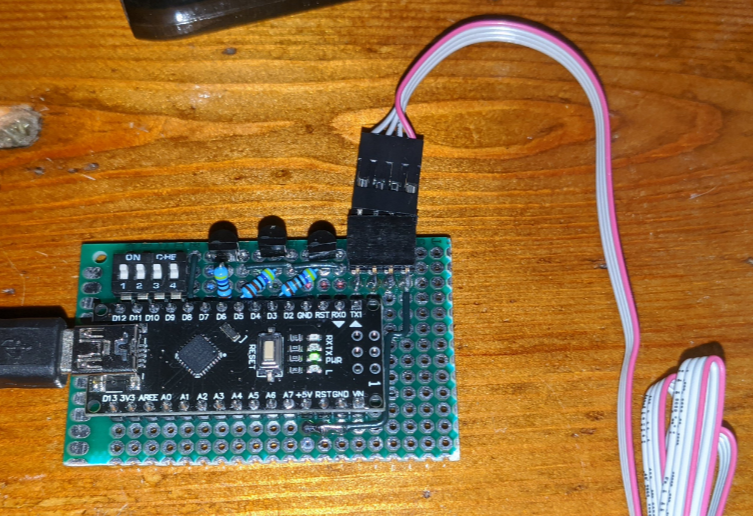

# LED_Strip
- This is the code for a small RGB LED strip controller I built

<figure>

<figcaption style="font-style: italic;">
The controller
</figcaption>
</figure>

- It is based of an Arduino Nano (clone) and uses bc337s to drive the strip
- It also has a 4 way dip swich to change configurations