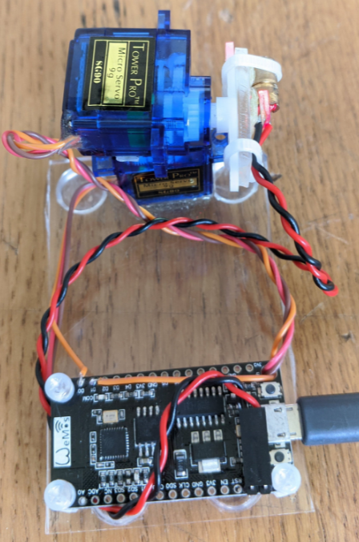

# Laser Turret
- This code is for a small laser turret I built using a couple of servos and a laser diode
- It is based on an esp8266 NodeMCU clone board thing
- In the future I plan to have this thing be internet connected so I can maybe control it via a Raspberry Pi running some sort of computer vision program to track a person...
- This project is a total rip off of Michael Reeves' Laser blinding machine :)

